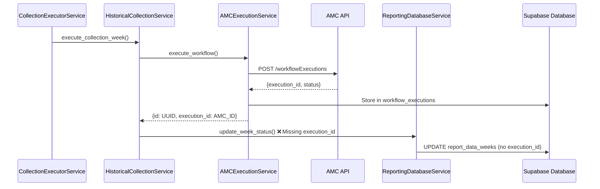
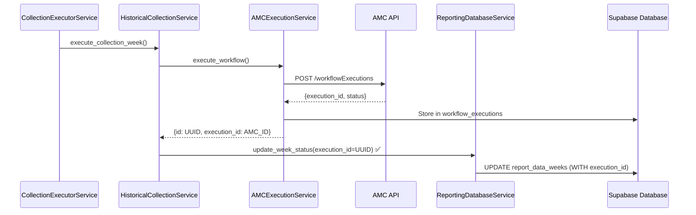

# Current Data Collection Flow Analysis

## Date: 2025-09-08
## Status: Completed Analysis

## Current Call Flow



## Identified Integration Points

### 1. **historical_collection_service.py:214-245**
```python
# Current implementation (PROBLEM AREA)
execution_result = await self.amc_execution.execute_workflow(
    workflow_id=collection['workflow_id'],
    user_id=collection['user_id'],
    execution_parameters=parameters,
    triggered_by='collection',
    instance_id=collection['instance_id']
)

# execution_result contains 'id' (UUID) but it's not passed forward
if execution_result and 'id' in execution_result:
    # ❌ ISSUE: execution_id is available but not used
    self.reporting_db.update_week_status(
        week_record_id,
        'completed',
        row_count=row_count,
        data_checksum=checksum
        # Missing: execution_id=execution_result['id']
    )
```

### 2. **reporting_database_service.py - update_week_status()**
```python
# Current implementation (NEEDS UPDATE)
def update_week_status(self, week_id: str, status: str, **kwargs) -> bool:
    updates = {'status': status}
    
    # Optional fields handling
    if 'execution_date' in kwargs:
        updates['execution_date'] = kwargs['execution_date']
    if 'row_count' in kwargs:
        updates['row_count'] = kwargs['row_count']
    if 'data_checksum' in kwargs:
        updates['data_checksum'] = kwargs['data_checksum']
    if 'error_message' in kwargs:
        updates['error_message'] = kwargs['error_message']
    
    # ❌ MISSING: No handling for execution_id parameter
```

## AMC Execution Response Structure

Based on `amc_execution_service.py:134-171`:
```python
# AMC API returns
{
    "workflowExecutionId": "abc123",  # AMC's execution ID
    "status": "PENDING",
    ...
}

# Service stores and returns
{
    "id": "uuid-here",           # Internal UUID (workflow_executions.id)
    "workflow_id": "uuid",
    "instance_id": "uuid", 
    "execution_id": "abc123",     # AMC's ID (stored in workflow_executions)
    "status": "pending",
    ...
}
```

## Required Changes Summary

### File 1: `reporting_database_service.py`
- **Method**: `update_week_status()`
- **Line**: ~83-108
- **Change**: Add `execution_id` parameter handling
```python
if 'execution_id' in kwargs:
    updates['execution_id'] = kwargs['execution_id']
```

### File 2: `historical_collection_service.py`
- **Method**: `execute_collection_week()`
- **Line**: ~234-240
- **Change**: Pass execution_id to update_week_status
```python
self.reporting_db.update_week_status(
    week_record_id,
    'completed',
    execution_id=execution_result.get('id'),  # Add this
    row_count=row_count,
    data_checksum=checksum
)
```

### File 3: `historical_collection_service.py`
- **Method**: `execute_collection_week()`
- **Line**: ~222-224
- **Change**: Store execution_id for AMC tracking
```python
# Also store AMC's execution ID if available
if 'amc_execution_id' in execution_result:
    kwargs['amc_execution_id'] = execution_result['amc_execution_id']
```

## Data Flow After Fix



## Method Signatures Requiring Update

### 1. ReportingDatabaseService.update_week_status()
**Current:**
```python
def update_week_status(self, week_id: str, status: str, **kwargs) -> bool
```
**After (no signature change, just internal handling):**
```python
def update_week_status(self, week_id: str, status: str, **kwargs) -> bool:
    # Now handles 'execution_id' in kwargs
```

### 2. HistoricalCollectionService.execute_collection_week()
**Current:**
```python
async def execute_collection_week(
    self,
    collection_id: str,
    week_record_id: str,
    week_start: date,
    week_end: date
) -> bool
```
**After (no signature change, just implementation):**
```python
# Same signature, but now passes execution_id to update_week_status
```

## Edge Cases to Handle

1. **Missing execution_id in response**
   - Continue without execution tracking
   - Log warning but don't fail the collection

2. **Failed AMC execution**
   - No execution_id to store
   - Error handling already in place

3. **Backward compatibility**
   - Existing code without execution_id parameter continues to work
   - kwargs approach maintains compatibility

## Testing Requirements

1. **Unit Tests**
   - Mock AMC response with execution_id
   - Verify execution_id is passed through chain
   - Test missing execution_id handling

2. **Integration Tests**
   - End-to-end data collection with execution tracking
   - Verify database storage of execution_id
   - Test foreign key relationship

## Risk Assessment

- **Low Risk**: Changes are additive, not breaking
- **No Breaking Changes**: Using kwargs maintains compatibility
- **Graceful Degradation**: System works even if execution_id missing
- **Database Safe**: Column already exists, just populating it

## Implementation Order

1. ✅ Verify schema (execution_id column exists)
2. ✅ Analyze code flow (this document)
3. ⏳ Update ReportingDatabaseService.update_week_status()
4. ⏳ Update HistoricalCollectionService.execute_collection_week()
5. ⏳ Add unit tests
6. ⏳ Test end-to-end