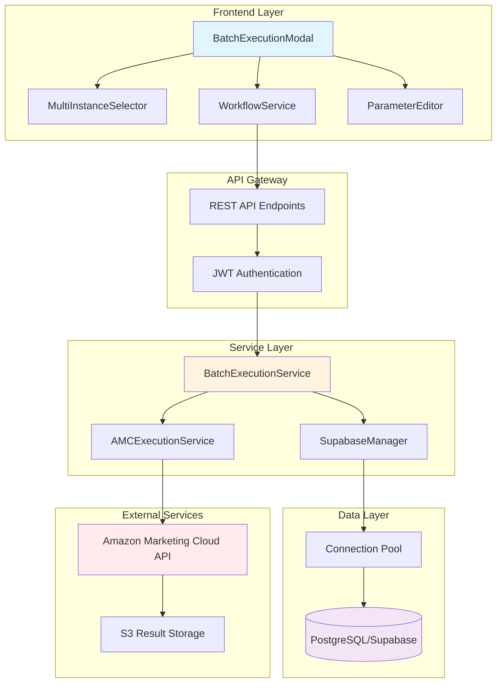
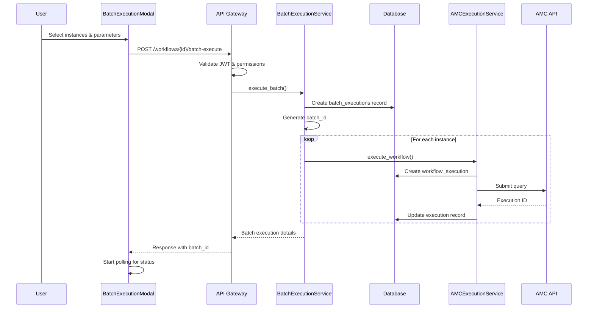
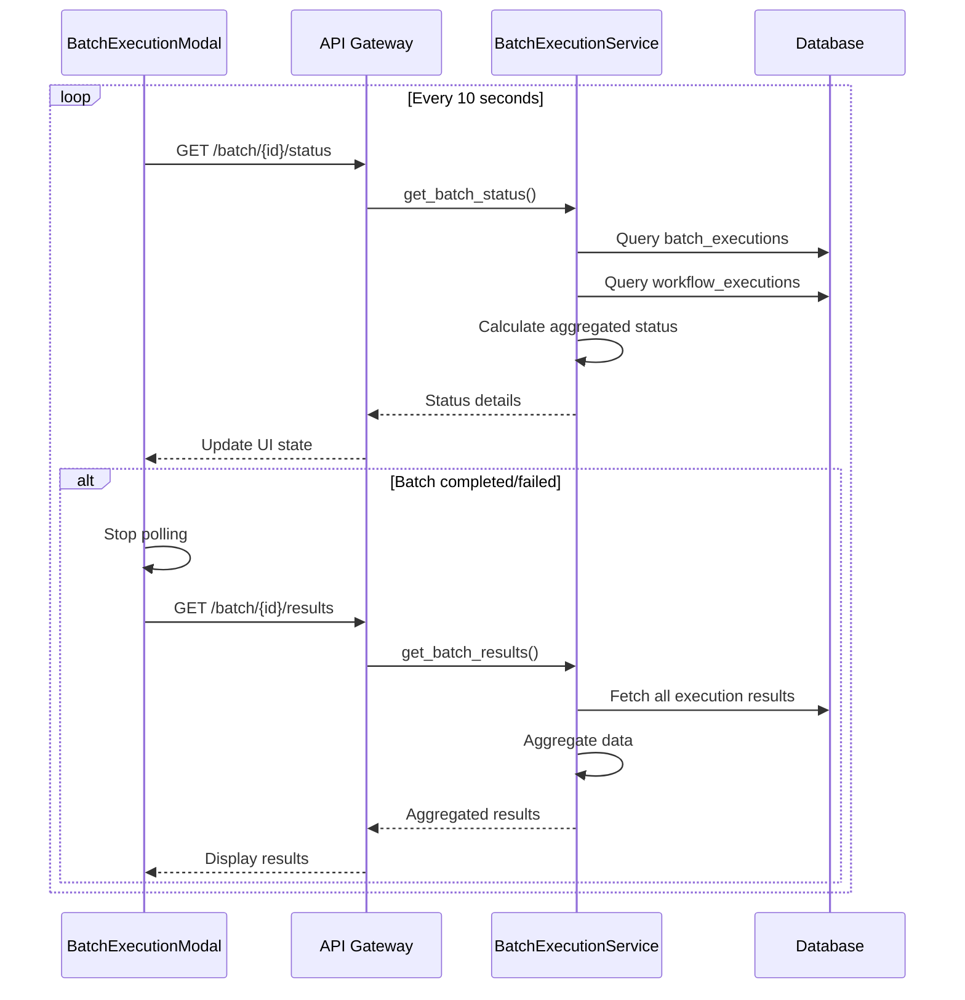
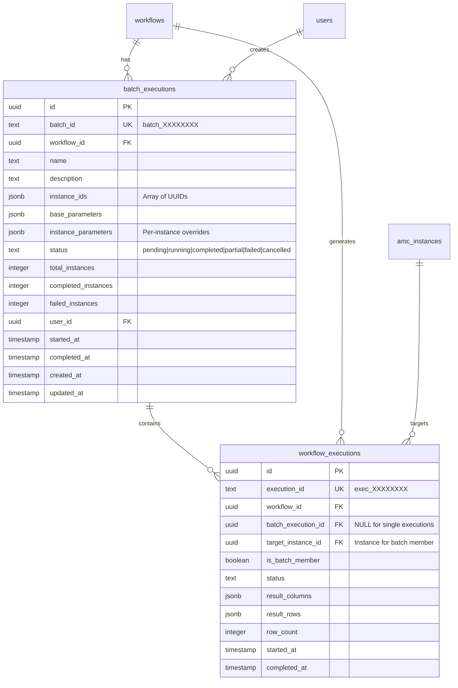
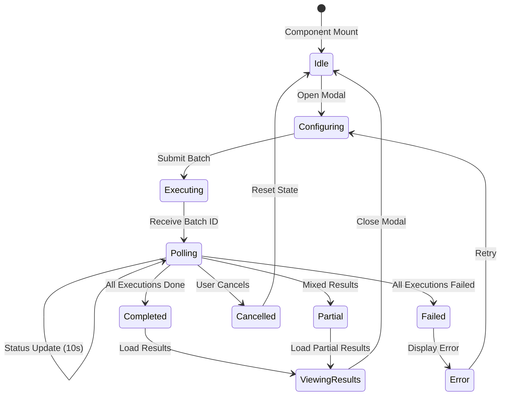
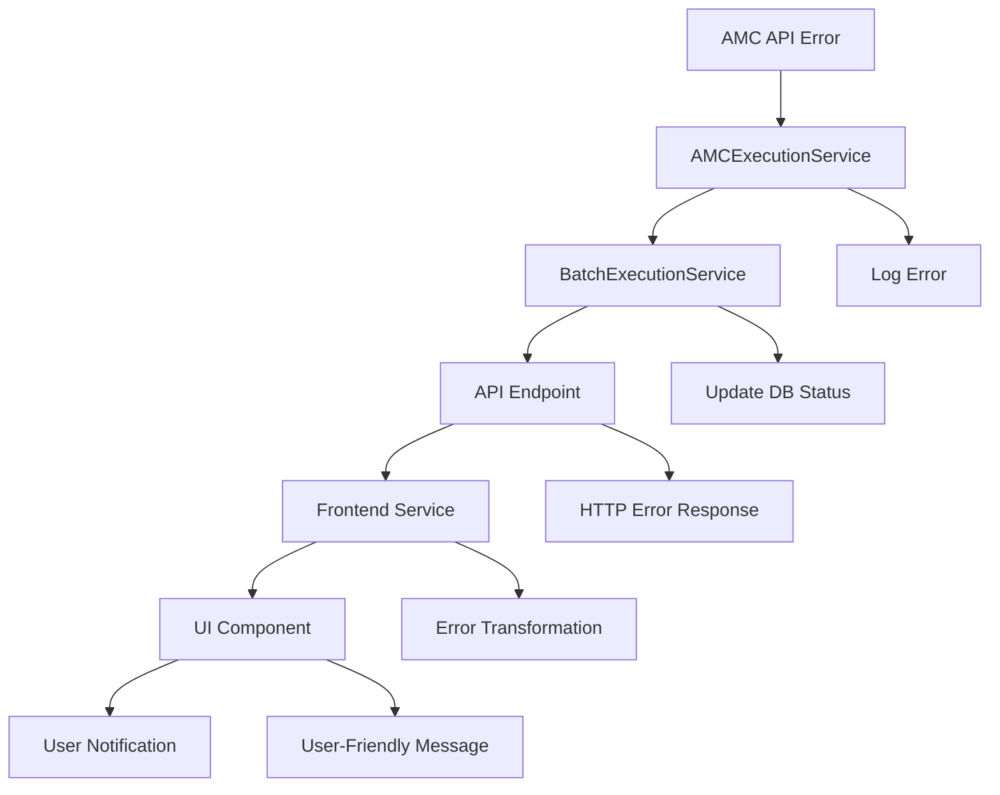
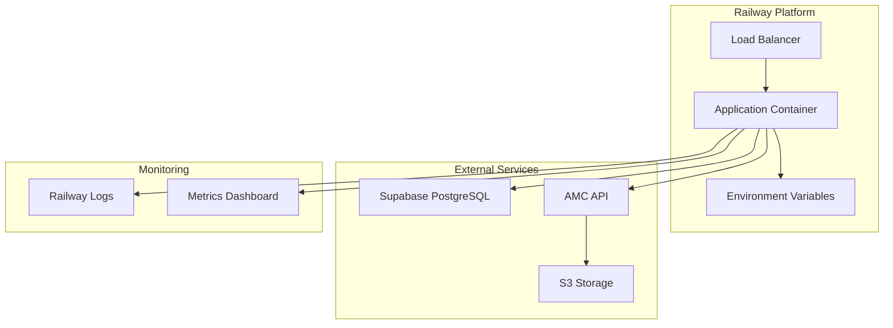

# Batch Execution System Architecture

## Table of Contents
1. [System Overview](#system-overview)
2. [System Architecture Diagram](#system-architecture-diagram)
3. [Data Flow Analysis](#data-flow-analysis)
4. [Component Interactions](#component-interactions)
5. [Database Design](#database-design)
6. [API Contract](#api-contract)
7. [State Management](#state-management)
8. [Error Handling Flow](#error-handling-flow)
9. [Performance Characteristics](#performance-characteristics)
10. [Security Architecture](#security-architecture)
11. [Deployment Architecture](#deployment-architecture)

## System Overview

The Batch Execution System enables users to execute Amazon Marketing Cloud (AMC) workflows across multiple instances simultaneously. This system orchestrates parallel execution, monitors progress, aggregates results, and provides real-time status updates through a responsive UI.

### Key Features
- **Multi-instance workflow execution** with configurable parameters
- **Rate-limited parallel processing** with automatic retry logic
- **Real-time status monitoring** with 10-second polling intervals
- **Result aggregation** across all instances with CSV export
- **Graceful error handling** with partial success support
- **Cancellation support** for in-progress batch executions

### Core Components
1. **BatchExecutionService** - Backend orchestration service
2. **Batch API Endpoints** - RESTful API for batch operations
3. **Database Schema** - PostgreSQL tables with triggers
4. **BatchExecutionModal** - React UI component
5. **WorkflowService** - Frontend service layer
6. **MultiInstanceSelector** - Instance selection UI

## System Architecture Diagram



## Data Flow Analysis

### 1. Batch Execution Initiation Flow



### 2. Status Monitoring Flow



### 3. Data Transformation Pipeline

```
Raw AMC Results → CSV Parsing → Object Transformation → Instance Tagging → Aggregation → UI Display

1. AMC returns CSV data as S3 URLs
2. Backend downloads and parses CSV
3. Transforms array format to object format
4. Adds instance identifiers (_instance_name, _instance_id)
5. Aggregates across all instances
6. Frontend displays in table/chart/raw formats
```

## Component Interactions

### Backend Components

#### BatchExecutionService
**Responsibilities:**
- Orchestrates multi-instance workflow execution
- Manages rate limiting (5 concurrent executions max)
- Implements retry logic with exponential backoff
- Tracks batch execution state
- Aggregates results across instances

**Key Methods:**
- `execute_batch()` - Main entry point for batch execution
- `get_batch_status()` - Returns current batch and execution states
- `get_batch_results()` - Aggregates and returns all results
- `cancel_batch_execution()` - Cancels in-progress executions

**Dependencies:**
- AMCExecutionService - For individual workflow execution
- SupabaseManager - For database operations
- asyncio.Semaphore - For rate limiting

#### API Endpoints
**Location:** `/amc_manager/api/supabase/workflows.py`

**Endpoints:**
- `POST /{workflow_id}/batch-execute` - Initiate batch execution
- `GET /batch/{batch_id}/status` - Get batch status
- `GET /batch/{batch_id}/results` - Get aggregated results
- `POST /batch/{batch_id}/cancel` - Cancel batch execution
- `GET /batch/list` - List all batch executions

**Security:**
- JWT authentication required via `Depends(get_current_user)`
- User access validation for workflows and instances
- Service role for elevated database operations

### Frontend Components

#### BatchExecutionModal
**State Management:**
```typescript
interface BatchExecutionState {
  selectedInstances: string[]      // Instance UUIDs
  parameters: Record<string, any>  // Execution parameters
  batchName: string                // User-defined name
  isExecuting: boolean             // Execution in progress
  batchId: string | null          // Current batch ID
  batchStatus: BatchStatus | null // Real-time status
  batchResults: BatchResults | null // Final results
  error: string | null            // Error messages
  viewMode: 'table' | 'chart' | 'raw' // Result view
}
```

**Lifecycle:**
1. **Initialization** - Load workflow parameters, generate default name
2. **Configuration** - User selects instances and adjusts parameters
3. **Execution** - Submit batch request, receive batch ID
4. **Monitoring** - Poll status every 10 seconds
5. **Completion** - Display results, enable export
6. **Cleanup** - Clear polling interval on unmount

#### MultiInstanceSelector
**Features:**
- Search across instance names, IDs, brands, accounts
- Bulk selection with "Select All" functionality
- Visual pills for selected instances
- Checkbox UI with brand indicators
- UUID-based selection for backend compatibility

## Database Design

### Entity Relationship Diagram



### Database Triggers

#### update_batch_execution_status()
**Purpose:** Automatically updates batch execution status based on child execution states

**Logic:**
```sql
-- Updates when child execution status changes:
1. Count completed/failed executions
2. Determine overall status:
   - 'running' if any executions running
   - 'partial' if mix of completed/failed
   - 'completed' if all completed
   - 'failed' if all failed
3. Set completed_at when batch finishes
```

### Indexes
- `idx_batch_executions_workflow_id` - Filter by workflow
- `idx_batch_executions_status` - Status queries
- `idx_batch_executions_user_id` - User's batches
- `idx_batch_executions_batch_id` - Lookup by batch ID
- `idx_workflow_executions_batch_id` - Child executions
- `idx_workflow_executions_target_instance` - Instance filtering

## API Contract

### Batch Execute Request
```typescript
POST /workflows/{workflow_id}/batch-execute
Headers:
  Authorization: Bearer {jwt_token}
  Content-Type: application/json

Request Body:
{
  "instance_ids": string[],        // Array of instance UUIDs
  "parameters": {                  // Base parameters for all
    "startDate": "2024-01-01",
    "endDate": "2024-01-31"
  },
  "instance_parameters": {         // Optional per-instance overrides
    "uuid-1": { "region": "US" },
    "uuid-2": { "region": "EU" }
  },
  "name": string,                  // Optional batch name
  "description": string            // Optional description
}

Response (200 OK):
{
  "success": true,
  "batch": {
    "batch_id": "batch_a1b2c3d4",
    "batch_execution_id": "uuid",
    "workflow_id": "uuid",
    "total_instances": 5,
    "status": "running",
    "executions": [
      {
        "instance_id": "uuid",
        "execution_id": "exec_12345678",
        "status": "pending"
      }
    ]
  }
}

Error Responses:
400 - Invalid request (empty instances, exceeded max batch size)
403 - Access denied to workflow or instances
404 - Workflow not found
500 - Server error
```

### Batch Status Request
```typescript
GET /workflows/batch/{batch_id}/status
Headers:
  Authorization: Bearer {jwt_token}

Response (200 OK):
{
  "success": true,
  "batch_status": {
    "batch_id": "batch_a1b2c3d4",
    "workflow_id": "uuid",
    "name": "Q4 Campaign Analysis",
    "status": "running",
    "total_instances": 5,
    "completed_instances": 2,
    "failed_instances": 1,
    "running_instances": 2,
    "pending_instances": 0,
    "started_at": "2024-01-15T10:00:00Z",
    "executions": [...],
    "status_counts": {
      "completed": 2,
      "failed": 1,
      "running": 2
    }
  }
}
```

### Batch Results Request
```typescript
GET /workflows/batch/{batch_id}/results
Headers:
  Authorization: Bearer {jwt_token}

Response (200 OK):
{
  "success": true,
  "batch_results": {
    "batch_id": "batch_a1b2c3d4",
    "status": "completed",
    "total_instances": 5,
    "completed_instances": 5,
    "failed_instances": 0,
    "instance_results": [
      {
        "instance_id": "uuid",
        "instance_name": "Production US",
        "instance_region": "us-east-1",
        "execution_id": "exec_12345678",
        "row_count": 1000,
        "duration_seconds": 45,
        "completed_at": "2024-01-15T10:01:00Z"
      }
    ],
    "aggregated_data": {
      "columns": [
        { "name": "_instance_name", "type": "string" },
        { "name": "_instance_id", "type": "string" },
        { "name": "campaign_id", "type": "string" },
        { "name": "impressions", "type": "number" }
      ],
      "rows": [...],
      "total_rows": 5000
    }
  }
}
```

## State Management

### Frontend State Flow



### Backend State Transitions

```python
# Batch Execution States
PENDING → RUNNING → COMPLETED
                 ↘ PARTIAL (some failed)
                 ↘ FAILED (all failed)
                 ↘ CANCELLED (user action)

# Individual Execution States
PENDING → RUNNING → COMPLETED
                 ↘ FAILED
                 ↘ CANCELLED
```

### State Synchronization
1. **Database as source of truth** - All state stored in PostgreSQL
2. **Trigger-based updates** - Database triggers maintain consistency
3. **Polling for freshness** - UI polls every 10 seconds
4. **Optimistic UI updates** - Immediate feedback on user actions
5. **Error recovery** - Automatic state reconciliation on errors

## Error Handling Flow

### Error Categories and Recovery

#### 1. Validation Errors (400)
```python
# Frontend validation
- Empty instance selection → Show inline error
- Missing required parameters → Highlight fields

# Backend validation
- Batch size > 100 → Return error message
- Invalid workflow ID → 404 response
- Invalid instance IDs → 403 response
```

#### 2. Permission Errors (403)
```python
# Access control checks
- User doesn't own workflow → Deny access
- User lacks instance access → Filter out instance
- Token expired → Redirect to login
```

#### 3. Transient Errors (Retryable)
```python
# Retry logic with exponential backoff
MAX_RETRY_ATTEMPTS = 3
RETRY_DELAY_BASE = 2  # seconds

for attempt in range(MAX_RETRY_ATTEMPTS):
    try:
        result = execute_instance()
        return result
    except TransientError:
        if attempt < MAX_RETRY_ATTEMPTS - 1:
            delay = RETRY_DELAY_BASE ** attempt
            await asyncio.sleep(delay)
        else:
            raise
```

#### 4. Non-Transient Errors (Non-Retryable)
```python
# Immediate failure conditions
non_transient_keywords = [
    'not found',
    'access denied', 
    'invalid',
    'unauthorized'
]

if any(keyword in error_message.lower() 
       for keyword in non_transient_keywords):
    # Fail immediately, don't retry
    raise error
```

### Error Propagation



### User-Facing Error Messages

```typescript
// Error message mapping in BatchExecutionModal
const errorMessages = {
  400: "Invalid request parameters",
  403: "You do not have permission to execute on one or more selected instances",
  404: "Workflow not found",
  500: "Server error occurred. Please try again later",
  TIMEOUT: "Request timed out. Please try again",
  NETWORK: "Network error. Please check your connection"
}
```

## Performance Characteristics

### Bottlenecks and Optimizations

#### 1. Concurrent Execution Limiting
```python
# Rate limiting configuration
MAX_CONCURRENT_EXECUTIONS = 5  # Prevents API throttling
execution_semaphore = asyncio.Semaphore(MAX_CONCURRENT_EXECUTIONS)

async with execution_semaphore:
    # Execute single instance
    result = await execute_instance()
```

**Impact:** Prevents overwhelming AMC API, ensures stable performance

#### 2. Database Query Optimization
```sql
-- Efficient batch status query with single join
SELECT 
    be.*,
    COUNT(we.id) as total_executions,
    COUNT(CASE WHEN we.status = 'completed' THEN 1 END) as completed
FROM batch_executions be
LEFT JOIN workflow_executions we ON we.batch_execution_id = be.id
WHERE be.batch_id = $1
GROUP BY be.id;
```

**Indexes used:**
- `idx_batch_executions_batch_id` - O(1) lookup
- `idx_workflow_executions_batch_id` - Efficient join

#### 3. Result Aggregation Performance
```python
# Memory-efficient streaming aggregation
all_rows = []
for execution in completed_executions:
    # Process results in chunks
    result_rows = execution.get('result_rows', [])
    
    # Add instance metadata
    for row in result_rows:
        row['_instance_name'] = instance_name
        all_rows.append(row)
    
    # Memory management for large datasets
    if len(all_rows) > 10000:
        # Implement pagination or streaming
        break
```

#### 4. Frontend Optimization
```typescript
// Polling efficiency
const POLL_INTERVAL = 10000;  // 10 seconds
const MAX_POLL_DURATION = 3600000;  // 1 hour timeout

// Virtualized table rendering for large results
import { FixedSizeList } from 'react-window';

// Debounced search in MultiInstanceSelector
const debouncedSearch = useMemo(
  () => debounce(handleSearch, 300),
  []
);
```

### Performance Metrics

| Metric | Target | Current | Notes |
|--------|--------|---------|-------|
| Batch creation time | < 1s | ~500ms | Database insert + ID generation |
| Instance execution start | < 2s | ~1.5s | Including AMC API call |
| Status polling latency | < 500ms | ~200ms | Database query time |
| Result aggregation (1000 rows) | < 2s | ~1s | In-memory processing |
| UI render time | < 100ms | ~50ms | React virtual DOM |
| Max concurrent batches | 10 | Unlimited | Per user |
| Max batch size | 100 | 100 | Hard limit |

## Security Architecture

### Authentication & Authorization

#### 1. JWT Token Validation
```python
# Every API endpoint requires authentication
async def get_current_user(
    authorization: str = Header(None)
) -> Dict[str, Any]:
    if not authorization:
        raise HTTPException(401, "Missing authorization")
    
    token = authorization.replace("Bearer ", "")
    try:
        payload = jwt.decode(token, SECRET_KEY, algorithms=["HS256"])
        return payload
    except jwt.JWTDecodeError:
        raise HTTPException(401, "Invalid token")
```

#### 2. Resource Access Control
```python
# Workflow ownership validation
workflow = db.table('workflows')\
    .select('*')\
    .eq('id', workflow_id)\
    .eq('user_id', current_user['id'])\
    .single()\
    .execute()

if not workflow.data:
    raise HTTPException(404, "Workflow not found")

# Instance access validation
user_instances = get_user_instances(current_user['id'])
for instance_id in request.instance_ids:
    if instance_id not in user_instance_ids:
        raise HTTPException(403, "Access denied")
```

#### 3. Row-Level Security (RLS)
```sql
-- PostgreSQL RLS policies
ALTER TABLE batch_executions ENABLE ROW LEVEL SECURITY;

CREATE POLICY "Users can view own batch executions"
    ON batch_executions FOR SELECT
    USING (auth.uid() = user_id);

CREATE POLICY "Users can create batch executions"
    ON batch_executions FOR INSERT
    WITH CHECK (auth.uid() = user_id);
```

### Data Protection

#### 1. Parameter Sanitization
```python
# Prevent SQL injection in dynamic queries
def sanitize_parameters(params: Dict[str, Any]) -> Dict[str, Any]:
    sanitized = {}
    for key, value in params.items():
        if isinstance(value, str):
            # Escape special characters
            sanitized[key] = value.replace("'", "''")
        else:
            sanitized[key] = value
    return sanitized
```

#### 2. Sensitive Data Handling
```python
# OAuth tokens encrypted with Fernet
from cryptography.fernet import Fernet

fernet = Fernet(FERNET_KEY)
encrypted_token = fernet.encrypt(access_token.encode())
# Store encrypted_token in database

# Decrypt when needed
decrypted_token = fernet.decrypt(encrypted_token).decode()
```

#### 3. API Rate Limiting
```python
# Prevent abuse through rate limiting
from slowapi import Limiter
limiter = Limiter(key_func=get_remote_address)

@router.post("/{workflow_id}/batch-execute")
@limiter.limit("10/minute")  # 10 batch executions per minute
async def batch_execute_workflow(...):
    pass
```

### Security Best Practices

1. **Principle of Least Privilege**
   - Service role only for system operations
   - User tokens for all user-initiated actions
   - Scoped permissions per resource

2. **Defense in Depth**
   - Frontend validation
   - API gateway validation
   - Service layer validation
   - Database constraints

3. **Audit Logging**
   ```python
   logger.info(f"Batch execution {batch_id} created by user {user_id}")
   logger.warning(f"Access denied for user {user_id} to instance {instance_id}")
   logger.error(f"Security violation: {violation_type}")
   ```

4. **Error Message Sanitization**
   ```python
   # Don't expose internal details
   except DatabaseError as e:
       logger.error(f"Database error: {e}")  # Log full error
       raise HTTPException(500, "Internal server error")  # Generic message
   ```

## Deployment Architecture

### Container Architecture

```yaml
# Docker Compose Services
services:
  frontend:
    build: ./frontend
    environment:
      - VITE_API_URL=${API_URL}
    ports:
      - "5173:5173"
  
  backend:
    build: .
    environment:
      - SUPABASE_URL=${SUPABASE_URL}
      - SUPABASE_ANON_KEY=${SUPABASE_ANON_KEY}
      - SUPABASE_SERVICE_ROLE_KEY=${SUPABASE_SERVICE_ROLE_KEY}
      - FERNET_KEY=${FERNET_KEY}
      - AMC_USE_REAL_API=${AMC_USE_REAL_API}
    ports:
      - "8001:8001"
    depends_on:
      - redis
  
  redis:
    image: redis:alpine
    ports:
      - "6379:6379"
```

### Production Deployment (Railway)



### Environment Configuration

#### Development
```bash
# .env.development
AMC_USE_REAL_API=false  # Use mock API
MAX_CONCURRENT_EXECUTIONS=2
BATCH_POLL_INTERVAL=5000  # 5 seconds for faster feedback
LOG_LEVEL=DEBUG
```

#### Production
```bash
# .env.production
AMC_USE_REAL_API=true
MAX_CONCURRENT_EXECUTIONS=5
BATCH_POLL_INTERVAL=10000  # 10 seconds
LOG_LEVEL=INFO
SENTRY_DSN=https://...  # Error tracking
```

### Scaling Considerations

#### Horizontal Scaling
```python
# Stateless service design enables horizontal scaling
# Each instance can handle batch executions independently

# Redis for distributed locking
import redis
r = redis.Redis()

def acquire_batch_lock(batch_id: str) -> bool:
    return r.set(f"batch_lock:{batch_id}", "1", nx=True, ex=300)
```

#### Vertical Scaling
```python
# Configurable concurrency limits
MAX_CONCURRENT_EXECUTIONS = int(os.getenv('MAX_CONCURRENT_EXECUTIONS', 5))
MAX_BATCH_SIZE = int(os.getenv('MAX_BATCH_SIZE', 100))

# Memory management for large results
RESULT_STREAMING_THRESHOLD = 10000  # Stream if > 10k rows
```

### Monitoring & Observability

#### Application Metrics
```python
# Prometheus metrics
from prometheus_client import Counter, Histogram

batch_executions_total = Counter(
    'batch_executions_total',
    'Total number of batch executions',
    ['status']
)

batch_execution_duration = Histogram(
    'batch_execution_duration_seconds',
    'Batch execution duration in seconds',
    buckets=[10, 30, 60, 120, 300, 600]
)
```

#### Health Checks
```python
@router.get("/health")
async def health_check():
    checks = {
        "database": check_database_connection(),
        "amc_api": check_amc_api_availability(),
        "redis": check_redis_connection()
    }
    
    if all(checks.values()):
        return {"status": "healthy", "checks": checks}
    else:
        return {"status": "degraded", "checks": checks}, 503
```

### Disaster Recovery

#### Backup Strategy
1. **Database backups** - Supabase automated daily backups
2. **Execution state recovery** - Persistent in PostgreSQL
3. **Result caching** - S3 URLs valid for 7 days

#### Failure Scenarios
1. **Database outage** → Read-only mode, queue writes
2. **AMC API down** → Retry with exponential backoff
3. **Frontend crash** → Stateless, resume from last state
4. **Batch execution stuck** → Timeout and mark as failed

### Deployment Checklist

- [ ] Environment variables configured
- [ ] Database migrations applied
- [ ] Indexes created for performance
- [ ] RLS policies enabled
- [ ] SSL certificates valid
- [ ] Health checks passing
- [ ] Monitoring alerts configured
- [ ] Rate limiting configured
- [ ] Error tracking enabled
- [ ] Backup schedule verified

## Summary

The Batch Execution System provides a robust, scalable solution for executing AMC workflows across multiple instances. Key architectural decisions include:

1. **Asynchronous processing** with Python asyncio for concurrent execution
2. **Rate limiting** to prevent API throttling
3. **Automatic retry logic** for transient failures
4. **Real-time status updates** through polling
5. **Result aggregation** with instance identification
6. **Comprehensive error handling** with user-friendly messages
7. **Security-first design** with JWT authentication and RLS
8. **Scalable architecture** supporting horizontal scaling
9. **Observable system** with metrics and health checks
10. **Resilient deployment** with failure recovery mechanisms

The system successfully balances performance, reliability, and user experience while maintaining security and data integrity throughout the batch execution lifecycle.