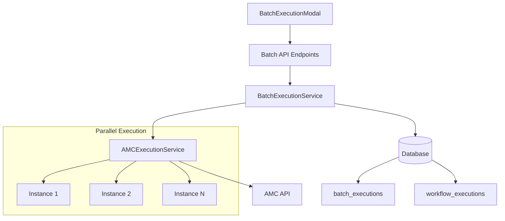

# Batch Execution System - Technical Documentation

## Table of Contents
1. [Architecture Overview](#architecture-overview)
2. [Database Schema](#database-schema)
3. [API Reference](#api-reference)
4. [Service Documentation](#service-documentation)
5. [Component Documentation](#component-documentation)
6. [Usage Examples](#usage-examples)
7. [Error Handling](#error-handling)
8. [Performance Considerations](#performance-considerations)

---

## Architecture Overview

### System Design

The batch execution system enables users to execute a single AMC workflow across multiple instances simultaneously, providing parallel execution, progress tracking, and result aggregation capabilities.



### Key Components

1. **Frontend Layer**
   - `BatchExecutionModal`: Main UI for configuring and monitoring batch executions
   - `MultiInstanceSelector`: Component for selecting multiple AMC instances
   - `workflowService`: TypeScript service for API communication

2. **API Layer**
   - RESTful endpoints for batch operations
   - Authentication and authorization middleware
   - Request validation using Pydantic models

3. **Service Layer**
   - `BatchExecutionService`: Orchestrates batch execution logic
   - `AMCExecutionService`: Handles individual workflow executions
   - Async/await pattern for parallel execution

4. **Data Layer**
   - `batch_executions` table: Tracks batch metadata
   - `workflow_executions` table: Stores individual execution results
   - Database triggers for automatic status updates

### Execution Flow

1. **Initiation Phase**
   - User selects multiple instances via MultiInstanceSelector
   - Configures shared parameters for all instances
   - Optional: Sets instance-specific parameter overrides
   - Creates batch execution record

2. **Execution Phase**
   - Parallel execution across all selected instances
   - Each instance execution runs independently
   - Real-time status updates via database triggers
   - Automatic batch status calculation

3. **Monitoring Phase**
   - Frontend polls for status updates (10-second intervals)
   - Progress bar shows completion percentage
   - Individual instance status tracking
   - Cancel capability for running batches

4. **Results Phase**
   - Aggregated results across all instances
   - Instance-specific result breakdown
   - Data visualization options (table/chart/raw)
   - CSV export functionality

---

## Database Schema

### Tables

#### `batch_executions`

Stores batch execution metadata and orchestration data.

| Column | Type | Description |
|--------|------|-------------|
| `id` | UUID | Primary key |
| `batch_id` | TEXT | Unique identifier (format: `batch_XXXXXXXX`) |
| `workflow_id` | UUID | Reference to workflows table |
| `name` | TEXT | User-provided batch name |
| `description` | TEXT | Optional description |
| `instance_ids` | JSONB | Array of instance UUIDs |
| `base_parameters` | JSONB | Common parameters for all instances |
| `instance_parameters` | JSONB | Per-instance parameter overrides |
| `status` | TEXT | Execution status (pending/running/completed/partial/failed/cancelled) |
| `total_instances` | INTEGER | Number of instances in batch |
| `completed_instances` | INTEGER | Count of successful executions |
| `failed_instances` | INTEGER | Count of failed executions |
| `user_id` | UUID | Reference to users table |
| `started_at` | TIMESTAMP | Batch start time |
| `completed_at` | TIMESTAMP | Batch completion time |
| `created_at` | TIMESTAMP | Record creation time |
| `updated_at` | TIMESTAMP | Last update time |

#### `workflow_executions` (Extended)

Additional columns for batch support:

| Column | Type | Description |
|--------|------|-------------|
| `batch_execution_id` | UUID | Reference to parent batch |
| `target_instance_id` | UUID | Specific instance for this execution |
| `is_batch_member` | BOOLEAN | Flag for batch membership |

### Database Objects

#### Indexes
```sql
idx_batch_executions_workflow_id
idx_batch_executions_status
idx_batch_executions_user_id
idx_batch_executions_batch_id
idx_workflow_executions_batch_id
idx_workflow_executions_target_instance
```

#### View: `batch_execution_summary`
Provides aggregated statistics for batch executions:
- Total/completed/failed/running/pending execution counts
- Average duration across instances
- Total rows returned
- First started and last completed timestamps

#### Trigger: `update_batch_status_on_execution_change`
Automatically updates batch execution status when child executions change:
- Calculates completed/failed instance counts
- Determines overall batch status (completed/partial/failed)
- Sets completion timestamp when all executions finish

#### Function: `generate_batch_id()`
Generates unique batch identifiers in format `batch_XXXXXXXX`

### Row-Level Security Policies

- Users can view their own batch executions
- Users can create batch executions
- Users can update their own batch executions
- Users can delete their own batch executions

---

## API Reference

### Endpoints

#### POST `/workflows/{workflow_id}/batch-execute`

Execute a workflow across multiple AMC instances.

**Request Body:**
```json
{
  "instance_ids": ["uuid1", "uuid2", "uuid3"],
  "parameters": {
    "startDate": "2024-01-01",
    "endDate": "2024-01-31",
    "customParam": "value"
  },
  "instance_parameters": {
    "uuid2": {
      "customParam": "override_value"
    }
  },
  "name": "Q1 Analysis Batch",
  "description": "Analyzing Q1 data across all regions"
}
```

**Response:**
```json
{
  "success": true,
  "batch": {
    "batch_id": "batch_a1b2c3d4",
    "batch_execution_id": "550e8400-e29b-41d4-a716-446655440000",
    "workflow_id": "660e8400-e29b-41d4-a716-446655440000",
    "total_instances": 3,
    "status": "running",
    "executions": [
      {
        "instance_id": "uuid1",
        "execution_id": "exec_12345678",
        "status": "pending"
      }
    ]
  }
}
```

#### GET `/workflows/batch/{batch_id}/status`

Get current status of a batch execution.

**Response:**
```json
{
  "success": true,
  "batch_status": {
    "batch_id": "batch_a1b2c3d4",
    "workflow_id": "660e8400-e29b-41d4-a716-446655440000",
    "name": "Q1 Analysis Batch",
    "status": "running",
    "total_instances": 3,
    "completed_instances": 1,
    "failed_instances": 0,
    "running_instances": 2,
    "pending_instances": 0,
    "started_at": "2024-01-15T10:30:00Z",
    "executions": [
      {
        "id": "770e8400-e29b-41d4-a716-446655440000",
        "target_instance_id": "uuid1",
        "status": "completed",
        "row_count": 1000,
        "duration_seconds": 45
      }
    ],
    "status_counts": {
      "completed": 1,
      "running": 2
    }
  }
}
```

#### GET `/workflows/batch/{batch_id}/results`

Get aggregated results from completed batch executions.

**Response:**
```json
{
  "success": true,
  "batch_results": {
    "batch_id": "batch_a1b2c3d4",
    "status": "completed",
    "total_instances": 3,
    "completed_instances": 3,
    "failed_instances": 0,
    "instance_results": [
      {
        "instance_id": "uuid1",
        "instance_name": "US-East Production",
        "instance_region": "us-east-1",
        "execution_id": "exec_12345678",
        "row_count": 1000,
        "duration_seconds": 45,
        "completed_at": "2024-01-15T10:31:00Z"
      }
    ],
    "aggregated_data": {
      "columns": [
        {"name": "_instance_name", "type": "string"},
        {"name": "_instance_id", "type": "string"},
        {"name": "metric", "type": "number"},
        {"name": "dimension", "type": "string"}
      ],
      "rows": [
        {
          "_instance_name": "US-East Production",
          "_instance_id": "uuid1",
          "metric": 100,
          "dimension": "value1"
        }
      ],
      "total_rows": 3000
    }
  }
}
```

#### POST `/workflows/batch/{batch_id}/cancel`

Cancel a running batch execution.

**Response:**
```json
{
  "success": true,
  "message": "Batch execution cancelled successfully"
}
```

#### GET `/workflows/batch/list`

List batch executions with optional filters.

**Query Parameters:**
- `workflow_id` (optional): Filter by workflow UUID
- `status` (optional): Filter by status
- `limit` (default: 20): Maximum results
- `offset` (default: 0): Pagination offset

**Response:**
```json
{
  "success": true,
  "batch_executions": [
    {
      "id": "550e8400-e29b-41d4-a716-446655440000",
      "batch_id": "batch_a1b2c3d4",
      "workflow_id": "660e8400-e29b-41d4-a716-446655440000",
      "name": "Q1 Analysis Batch",
      "status": "completed",
      "total_instances": 3,
      "completed_instances": 3,
      "created_at": "2024-01-15T10:30:00Z",
      "workflows": {
        "name": "Revenue Analysis",
        "description": "Quarterly revenue analysis query"
      }
    }
  ],
  "total": 1
}
```

---

## Service Documentation

### BatchExecutionService

Primary service for orchestrating batch executions.

#### Methods

##### `generate_batch_id() -> str`
Generates a unique batch identifier.

**Returns:** String in format `batch_XXXXXXXX`

**Example:**
```python
batch_id = service.generate_batch_id()
# Returns: "batch_a1b2c3d4"
```

##### `create_batch_execution(...) -> Dict[str, Any]`
Creates a new batch execution record in the database.

**Parameters:**
- `workflow_id` (str): UUID of the workflow to execute
- `instance_ids` (List[str]): List of instance UUIDs
- `parameters` (Dict): Base parameters for all instances
- `instance_parameters` (Optional[Dict]): Per-instance overrides
- `name` (Optional[str]): Batch execution name
- `description` (Optional[str]): Description
- `user_id` (str): User UUID

**Returns:** Dictionary containing the created batch execution record

##### `execute_batch(...) -> Dict[str, Any]`
Executes a workflow across multiple instances in parallel.

**Parameters:** Same as `create_batch_execution`

**Returns:**
```python
{
    'batch_id': 'batch_a1b2c3d4',
    'batch_execution_id': 'uuid',
    'workflow_id': 'uuid',
    'total_instances': 3,
    'status': 'running',
    'executions': [...]
}
```

##### `_execute_single_instance(...) -> Dict[str, Any]`
Internal method for executing on a single instance.

**Key Features:**
- Converts instance UUID to AMC instance ID
- Links execution to parent batch
- Runs in thread executor for async operation

##### `get_batch_status(batch_id: str) -> Dict[str, Any]`
Retrieves current status and execution details.

**Returns:** Comprehensive status including:
- Overall batch status
- Instance-level execution status
- Progress statistics
- Execution timeline

##### `get_batch_results(batch_id: str) -> Dict[str, Any]`
Retrieves and aggregates results from completed executions.

**Features:**
- Combines results from all instances
- Adds instance identifiers to each row
- Provides instance-level statistics
- Formats data for visualization

##### `cancel_batch_execution(batch_id: str) -> bool`
Cancels a running batch and all child executions.

**Process:**
1. Updates batch status to 'cancelled'
2. Cancels all pending/running child executions
3. Sets completion timestamp

##### `list_batch_executions(...) -> List[Dict[str, Any]]`
Lists batch executions with filtering and pagination.

**Parameters:**
- `workflow_id`: Filter by workflow
- `user_id`: Filter by user
- `status`: Filter by status
- `limit`: Maximum results (default: 20)
- `offset`: Pagination offset

---

## Component Documentation

### BatchExecutionModal

Main React component for batch execution UI.

#### Props

```typescript
interface BatchExecutionModalProps {
  isOpen: boolean;
  onClose: () => void;
  workflow: {
    id: string;
    name: string;
    description?: string;
    parameters?: Record<string, any>;
    sql_query: string;
    instance_id?: string;
  };
  instances: any[];
  onExecutionComplete?: () => void;
}
```

#### State Management

- `selectedInstances`: Array of selected instance IDs
- `parameters`: Execution parameters
- `batchName`: User-provided batch name
- `isExecuting`: Execution state flag
- `batchId`: Current batch ID
- `batchStatus`: Real-time status object
- `batchResults`: Aggregated results
- `viewMode`: Display mode (table/chart/raw)

#### Key Features

1. **Instance Selection**
   - Multi-select dropdown with search
   - Brand and region display
   - Select all/clear all functionality

2. **Parameter Configuration**
   - Shared parameters for all instances
   - Instance-specific overrides (future enhancement)
   - Parameter validation

3. **Execution Monitoring**
   - Real-time progress bar
   - Individual instance status cards
   - Status counts (pending/running/completed/failed)
   - 10-second polling interval

4. **Results Display**
   - Table view with virtualization
   - Chart visualization
   - Raw JSON view
   - CSV export
   - Instance result summary

### MultiInstanceSelector

Specialized dropdown for selecting multiple AMC instances.

#### Props

```typescript
interface MultiInstanceSelectorProps {
  instances: Instance[];
  value: string[];  // Selected instance IDs
  onChange: (instanceIds: string[]) => void;
  placeholder?: string;
  maxHeight?: string;
}
```

#### Features

1. **Search Capabilities**
   - Search by instance name
   - Search by instance ID
   - Search by brand names
   - Search by account name

2. **Selection Management**
   - Checkbox selection
   - Select all visible
   - Clear all selections
   - Pill display for selected items

3. **Visual Indicators**
   - Brand tags
   - Sandbox badges
   - Region display
   - Account information

4. **Performance Optimizations**
   - Memoized filtering
   - Virtualized list (for large datasets)
   - Debounced search

---

## Usage Examples

### Basic Batch Execution

```python
# Python backend example
from amc_manager.services.batch_execution_service import BatchExecutionService

service = BatchExecutionService()

# Execute workflow across multiple instances
result = await service.execute_batch(
    workflow_id="660e8400-e29b-41d4-a716-446655440000",
    instance_ids=[
        "550e8400-e29b-41d4-a716-446655440001",
        "550e8400-e29b-41d4-a716-446655440002",
        "550e8400-e29b-41d4-a716-446655440003"
    ],
    parameters={
        "startDate": "2024-01-01",
        "endDate": "2024-01-31",
        "aggregationLevel": "daily"
    },
    name="January Performance Analysis",
    user_id="770e8400-e29b-41d4-a716-446655440000"
)

print(f"Batch ID: {result['batch_id']}")
```

### Frontend Integration

```typescript
// TypeScript frontend example
import { workflowService } from '../services/workflowService';

// Execute batch
const executeBatch = async () => {
  const result = await workflowService.batchExecuteWorkflow(
    workflowId,
    {
      instanceIds: selectedInstances,
      parameters: {
        startDate: '2024-01-01',
        endDate: '2024-01-31'
      },
      name: 'Q1 Analysis Batch'
    }
  );
  
  // Poll for status
  const pollStatus = setInterval(async () => {
    const status = await workflowService.getBatchStatus(result.batchId);
    
    if (status.status === 'completed' || status.status === 'failed') {
      clearInterval(pollStatus);
      
      // Get results
      const results = await workflowService.getBatchResults(result.batchId);
      console.log('Batch results:', results);
    }
  }, 10000);
};
```

### Instance-Specific Parameters

```python
# Override parameters for specific instances
result = await service.execute_batch(
    workflow_id=workflow_id,
    instance_ids=instance_ids,
    parameters={
        "metric": "revenue",
        "window": 7
    },
    instance_parameters={
        "instance_uuid_2": {
            "window": 14  # Override window for this instance
        },
        "instance_uuid_3": {
            "metric": "profit"  # Different metric for this instance
        }
    }
)
```

### Monitoring and Cancellation

```python
# Monitor batch execution
status = await service.get_batch_status("batch_a1b2c3d4")

print(f"Status: {status['status']}")
print(f"Progress: {status['completed_instances']}/{status['total_instances']}")

# Cancel if needed
if status['status'] == 'running':
    cancelled = await service.cancel_batch_execution("batch_a1b2c3d4")
    print(f"Cancelled: {cancelled}")
```

---

## Error Handling

### Error Codes and Recovery

#### API Errors

| Error Code | Description | Recovery Action |
|------------|-------------|-----------------|
| 403 | Access denied to instance | Verify user has access to all selected instances |
| 404 | Workflow not found | Check workflow ID exists and user owns it |
| 500 | Server error during execution | Retry operation or check logs |

#### Execution Errors

1. **Instance Connection Failures**
   - Error logged per instance
   - Batch continues for other instances
   - Status marked as 'partial' if some succeed

2. **Parameter Validation Errors**
   - Validation occurs before execution starts
   - Clear error messages returned to UI
   - No partial execution

3. **Timeout Errors**
   - Individual instance timeouts don't affect others
   - Failed instances marked accordingly
   - Batch completes with 'partial' status

### Error Handling Patterns

```python
# Backend error handling
try:
    result = await service.execute_batch(...)
except ValueError as e:
    # Validation error
    logger.error(f"Validation error: {e}")
    raise HTTPException(status_code=400, detail=str(e))
except Exception as e:
    # Unexpected error
    logger.error(f"Batch execution failed: {e}")
    raise HTTPException(status_code=500, detail="Batch execution failed")
```

```typescript
// Frontend error handling
try {
  const result = await workflowService.batchExecuteWorkflow(...);
} catch (error: any) {
  if (error.response?.status === 403) {
    showError('You do not have access to one or more selected instances');
  } else if (error.response?.status === 400) {
    showError(`Validation error: ${error.response.data.detail}`);
  } else {
    showError('Failed to execute batch. Please try again.');
  }
}
```

### Logging and Debugging

#### Log Locations
- Backend logs: Application logs with `[BatchExecutionService]` prefix
- Database logs: `batch_executions` and `workflow_executions` tables
- Frontend logs: Browser console with `[BatchExecution]` prefix

#### Debug Information
```python
# Enable debug logging
import logging
logging.getLogger('amc_manager.services.batch_execution_service').setLevel(logging.DEBUG)

# Log batch execution details
logger.debug(f"Batch {batch_id}: Executing on {len(instance_ids)} instances")
logger.debug(f"Parameters: {parameters}")
logger.debug(f"Instance overrides: {instance_parameters}")
```

---

## Performance Considerations

### Limits and Constraints

#### System Limits

| Limit | Value | Description |
|-------|-------|-------------|
| Max instances per batch | 100 | Recommended maximum for optimal performance |
| Polling interval | 10 seconds | Status update frequency |
| Execution timeout | 30 minutes | Per-instance execution timeout |
| Result row limit | 1,000,000 | Maximum aggregated rows |
| Parameter size | 10 KB | Maximum size for parameters JSON |

#### Database Constraints

- Batch ID uniqueness enforced
- Foreign key constraints on workflow and user references
- Index optimization for status queries
- Automatic cleanup via CASCADE deletes

### Performance Optimization

#### Parallel Execution
```python
# Executions run in parallel using asyncio
tasks = []
for instance_id in instance_ids:
    task = self._execute_single_instance(...)
    tasks.append(task)

# All instances execute simultaneously
execution_results = await asyncio.gather(*tasks, return_exceptions=True)
```

#### Database Optimization
1. **Indexes**: All foreign keys and frequently queried columns indexed
2. **Batch Updates**: Status updates use database triggers
3. **Connection Pooling**: Supabase client uses connection pooling
4. **Query Optimization**: Joins minimized, selective column retrieval

#### Frontend Optimization
1. **Virtualized Tables**: Large result sets use react-window
2. **Memoization**: Expensive computations cached
3. **Debouncing**: Search inputs debounced
4. **Lazy Loading**: Results loaded on demand

### Scaling Considerations

#### Horizontal Scaling
- Stateless service design allows multiple API instances
- Database handles concurrent batch executions
- No in-memory state between requests

#### Vertical Scaling
- Increase worker threads for more parallel executions
- Adjust database connection pool size
- Increase memory for large result aggregation

#### Best Practices

1. **Batch Size**
   - Keep batches under 50 instances for optimal performance
   - Split large batches into multiple smaller ones
   - Consider instance region proximity

2. **Parameter Optimization**
   - Minimize parameter payload size
   - Use instance parameters sparingly
   - Cache common parameter sets

3. **Result Management**
   - Implement pagination for large results
   - Use streaming for CSV exports
   - Archive old batch executions

4. **Monitoring**
   - Set up alerts for failed batches
   - Monitor execution duration trends
   - Track resource utilization

### Example Performance Metrics

| Metric | Value | Notes |
|--------|-------|-------|
| Batch creation | < 100ms | Database insert |
| Single execution launch | < 500ms | Per instance |
| Status polling | < 50ms | Database query |
| Result aggregation (1000 rows) | < 200ms | In-memory processing |
| Result aggregation (100k rows) | < 2s | With pagination |
| CSV export (1M rows) | < 10s | Streaming export |

---

## Appendix

### Migration Rollback

If needed, the batch execution feature can be rolled back:

```sql
-- Rollback migration
DROP TRIGGER IF EXISTS update_batch_status_on_execution_change ON workflow_executions;
DROP FUNCTION IF EXISTS update_batch_execution_status();
DROP FUNCTION IF EXISTS generate_batch_id();
DROP VIEW IF EXISTS batch_execution_summary;

ALTER TABLE workflow_executions 
DROP COLUMN IF EXISTS batch_execution_id,
DROP COLUMN IF EXISTS target_instance_id,
DROP COLUMN IF EXISTS is_batch_member;

DROP TABLE IF EXISTS batch_executions;
```

### Future Enhancements

1. **Scheduled Batch Execution**
   - Cron-based scheduling
   - Recurring batch jobs
   - Dependency management

2. **Advanced Parameter Management**
   - Parameter templates
   - Dynamic parameter generation
   - Conditional parameters

3. **Enhanced Results Processing**
   - Real-time result streaming
   - Custom aggregation functions
   - Result comparison tools

4. **Notification System**
   - Email notifications on completion
   - Webhook integration
   - Slack/Teams notifications

5. **Advanced Analytics**
   - Batch execution history analysis
   - Performance trending
   - Cost optimization recommendations

### Support and Maintenance

For issues or questions regarding the batch execution system:
1. Check application logs for detailed error messages
2. Verify database migrations have been applied
3. Ensure all instances have proper permissions
4. Review this documentation for troubleshooting steps

---

*Document Version: 1.0*  
*Last Updated: 2025-08-11*  
*System Version: AMC Batch Execution v1.0*