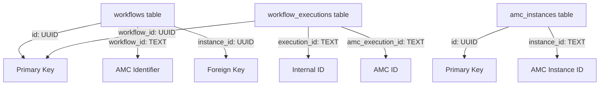

# ID Field Reference Guide

## Critical Understanding: Database ID Relationships

This document explains the different ID fields used throughout the application and their relationships. **This is critical for avoiding database query errors.**

## Table Structure

### workflows table
- **`id`** (UUID) - Internal database primary key
  - Example: `a1b2c3d4-e5f6-7890-abcd-ef1234567890`
  - Used for: Foreign key relationships with other tables
  - Referenced by: `workflow_executions.workflow_id`
  
- **`workflow_id`** (TEXT) - AMC-compliant identifier
  - Example: `wf_916558f8`
  - Used for: Display, API routes, user-facing identifiers
  - NOT used for: Foreign key relationships

### workflow_executions table
- **`id`** (UUID) - Internal database primary key
- **`workflow_id`** (UUID) - **Foreign key to `workflows.id`** ⚠️
  - NOT referencing `workflows.workflow_id` despite the name!
- **`execution_id`** (TEXT) - Internal execution identifier
  - Example: `exec_12345678`
- **`amc_execution_id`** (TEXT) - AMC's execution ID
  - Used for polling AMC API for status

### amc_instances table
- **`id`** (UUID) - Internal database primary key
- **`instance_id`** (TEXT) - AMC instance identifier
  - Example: `amcusecase-1234567890`
  - Used for: AMC API calls

## Common Pitfalls and Solutions

### ❌ WRONG: Using workflow_id for execution queries
```python
# This will fail with "invalid input syntax for type uuid"
workflow_ids = [w['workflow_id'] for w in workflows]  # Gets 'wf_916558f8'
exec_response = client.table('workflow_executions')\
    .in_('workflow_id', workflow_ids)\  # Expects UUID, gets string
    .execute()
```

### ✅ CORRECT: Using id (UUID) for execution queries
```python
# Use the UUID 'id' field for foreign key relationships
workflow_uuids = [w['id'] for w in workflows]  # Gets UUID
exec_response = client.table('workflow_executions')\
    .in_('workflow_id', workflow_uuids)\  # Matches UUID foreign key
    .execute()
```

## API Response Mapping

When returning data to the frontend:

```python
return {
    "id": w['workflow_id'],           # Frontend expects string ID
    "workflowId": w['workflow_id'],   # Redundant but for compatibility
    "internalId": w['id'],            # UUID (optional, for debugging)
    "lastExecutedAt": last_executions.get(w['id'])  # Use UUID for lookup
}
```

## Query Patterns

### Getting executions for a workflow
```python
# Given a workflow record with both 'id' and 'workflow_id'
workflow = get_workflow(...)

# Use the UUID 'id' for database queries
executions = client.table('workflow_executions')\
    .select('*')\
    .eq('workflow_id', workflow['id'])  # NOT workflow['workflow_id']
    .execute()
```

### Finding workflow by string ID
```python
# When you have the string workflow_id (e.g., from URL)
workflow = client.table('workflows')\
    .select('*')\
    .eq('workflow_id', 'wf_916558f8')  # Use string field
    .execute()
```

## Frontend Considerations

The frontend typically uses the string `workflow_id` for:
- URL routes: `/workflows/wf_916558f8`
- Display purposes
- API calls to backend

The backend must:
1. Accept the string `workflow_id` from frontend
2. Look up the workflow record
3. Use the UUID `id` for any foreign key queries

## Database Schema Relationships



## Quick Reference Table

| Table | Field | Type | Purpose | Example |
|-------|-------|------|---------|---------|
| workflows | id | UUID | Primary key, foreign key target | `a1b2c3d4-...` |
| workflows | workflow_id | TEXT | AMC identifier, user-facing | `wf_916558f8` |
| workflow_executions | workflow_id | UUID | Foreign key to workflows.id | `a1b2c3d4-...` |
| workflow_executions | execution_id | TEXT | Internal execution ID | `exec_12345678` |
| workflow_executions | amc_execution_id | TEXT | AMC's execution ID | `12345678-abcd-...` |
| amc_instances | id | UUID | Primary key | `b2c3d4e5-...` |
| amc_instances | instance_id | TEXT | AMC instance identifier | `amcusecase-123` |

## Testing Queries

To verify correct ID usage:

```sql
-- Check workflow and its executions
SELECT 
    w.id as workflow_uuid,
    w.workflow_id as workflow_string_id,
    we.workflow_id as execution_workflow_ref,
    we.execution_id
FROM workflows w
LEFT JOIN workflow_executions we ON we.workflow_id = w.id
WHERE w.workflow_id = 'wf_916558f8';
```

## Migration Notes

If you encounter UUID errors:
1. Check which field you're using for the query
2. Verify the data type expected by the foreign key
3. Use `workflows.id` (UUID) for joins, not `workflows.workflow_id` (TEXT)

## Related Files

Files that handle these ID relationships:
- `/amc_manager/api/supabase/workflows.py` - List workflows with executions
- `/amc_manager/services/db_service.py` - Database queries
- `/amc_manager/services/amc_execution_service.py` - Execution management
- `/frontend/src/services/workflowService.ts` - Frontend API calls

---

**Last Updated**: 2025-01-12
**Critical Fix**: Changed workflow execution queries to use UUID instead of string workflow_id